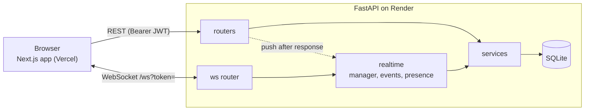
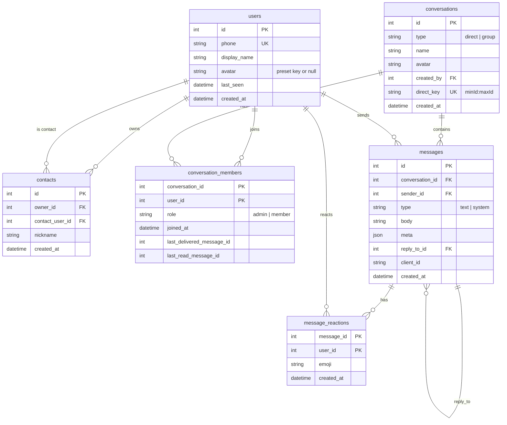

# Signal Clone

A functional clone of the Signal messaging app: real-time 1:1 and group chat with delivery/read receipts, typing indicators and presence. Built for the Scaler SDE Fullstack assignment.

| | |
|---|---|
| **Frontend** | https://signal-clone-three-beryl.vercel.app |
| **Backend** | https://signal-clone-g1pz.onrender.com (health: `/health`) |

> The backend runs on Render's free tier, which sleeps after 15 minutes idle: the first request after a nap can take ~30–50 s while it wakes. `GET /health` is monitored every 5 minutes by an uptime pinger, which keeps it warm.

## Test logins

OTP and encryption are **mocked**: there is no SMS, and every number accepts the code **`123456`**.

| User | Phone | Notes |
|---|---|---|
| Priya Sharma | `+919876543210` | Main demo user; admin of "Weekend Trek" |
| Rahul Verma | `+919812345678` | Long chat with Priya (100+ messages) |
| Ananya Iyer | `+919898989898` | |
| Vikram Singh | `+919845012345` | |
| Meera Nair | `+919900112233` | Admin of "Book Club" |
| Arjun Mehta | `+919731234567` | |

Any other valid number signs up a new account (name and avatar on first login). The login screen lists the first three accounts; click one to fill it in.

## Try it in 2 minutes

1. Open the app in two windows (a normal one and a private one).
2. Log in as **Priya** (`+919876543210`) in one and **Rahul** (`+919812345678`) in the other, code `123456`.
3. Open the Priya ↔ Rahul chat in both. Send a message: it appears instantly on the other side, and the ticks go **sent → delivered → read** as soon as the other window has the chat open.
4. Start typing: the other window shows "typing…" in the header, the chat and the sidebar.
5. Hover a message → **Reply**, then send; the quote appears in both windows. Click the quote to jump to the original.
6. Hover a message → **React** (smiley) and pick an emoji: the chip appears under the bubble in both windows. Click the chip again to remove it.
7. Click **New group** (next to New chat), pick contacts, name it. Click the group's header to open **Group info**: rename it, add or remove members, make someone admin. Every window updates live, with system messages ("You added Meera").
8. Profile menu → **Settings** → Appearance: switch System / Light / Dark.

## Features

| Brief | What's built |
|---|---|
| Onboarding / login | Phone + mocked OTP, JWT session in `localStorage`, name and avatar (initials or presets) on first login; logout |
| Contacts and conversation list | Add contacts by phone (with nickname), conversation list ordered by latest activity with previews, times and unread badges; search over contacts and chat names |
| 1:1 messaging | Optimistic send with retry, history with infinite scroll (30 per page), **sent / delivered / read** ticks, reply-to and emoji reactions |
| Typing and presence | "typing…" indicators; online dot and "last seen"; no flicker on refresh |
| Persistence | Everything is stored in SQLite and reloaded on refresh; the socket reconnects and catches up by itself |
| Groups | Create, rename, add / remove members, promote / demote admins, leave; system messages; live updates for every member |
| Signal-like settings | Settings dialog (profile, appearance, keyboard shortcuts, about) with "coming soon" placeholders for privacy, notifications, calls, stories and linked devices |

### Bonuses

| Bonus | Status |
|---|---|
| Dark mode (System / Light / Dark, no flash on load) | ✅ Done |
| Reply to a message (quote, jump to original) | ✅ Done |
| Keyboard shortcuts | ✅ Done |
| Responsive layout (one pane at a time on phones) | ✅ Done |
| Attachments | ❌ Not built |
| Reactions (❤️ 👍 👎 😂 😮 😢, one per person per message, live) | ✅ Done |
| Disappearing messages | ❌ Not built |
| Message-body search | ❌ Not built (search covers names and phones only) |

## Tech stack

| Layer | Tech |
|---|---|
| Frontend | Next.js 16.4 (App Router), React 19, TypeScript 5, Tailwind CSS 4, Zustand 5, Radix UI (Dialog, DropdownMenu) |
| Backend | Python 3.12, FastAPI 0.142, SQLAlchemy 2.1, SQLite, PyJWT, Uvicorn |
| Tests | pytest (backend: services, REST and real WebSocket round-trips) |
| Hosting | Vercel (frontend), Render (backend) |

## Run locally

**Backend** (http://localhost:8000):

```bash
cd backend
python -m venv .venv
source .venv/bin/activate          # Windows: .venv\Scripts\activate
pip install -r requirements-dev.txt
cp .env.example .env
uvicorn app.main:app --reload --port 8000
```

On startup the server creates the tables and, if the database has no users yet, seeds the demo data. Delete `backend/signal.db` (plus `-wal`/`-shm`) while the server is stopped to reseed.

| Variable | Default | Purpose |
|---|---|---|
| `SECRET_KEY` | dev-only placeholder | HS256 key for JWTs (use 32+ random characters) |
| `CORS_ORIGINS` | `http://localhost:3000` | Comma-separated allowed browser origins (no trailing slash) |
| `DATABASE_URL` | `sqlite:///./signal.db` | SQLAlchemy URL |
| `PRESENCE_GRACE_SECONDS` | `5` | Seconds a user stays "online" after their last socket closes |

**Frontend** (http://localhost:3000):

```bash
cd frontend
npm install
cp .env.example .env.local
npm run dev
```

| Variable | Default | Purpose |
|---|---|---|
| `NEXT_PUBLIC_API_URL` | `http://localhost:8000` | REST base URL |
| `NEXT_PUBLIC_WS_URL` | `ws://localhost:8000/ws` | WebSocket URL (`wss://…/ws` in production) |

`NEXT_PUBLIC_*` values are baked in at build time, so redeploy after changing them.

**Checks:**

```bash
cd backend && pytest -q        # 191 tests
cd frontend && npm run lint && npm run build
```

## Architecture



**Backend layers** (`backend/app/`)
- `routers/`: HTTP only (parse, call a service, return). `deps.py` resolves the Bearer token to a user (401 otherwise).
- `services/`: all rules (auth, contacts, conversations, messages, receipts, groups, search). They raise `ServiceError` subclasses, which become 400/403/404/409.
- `realtime/`:
  - `manager.py` maps user id → open sockets (in memory);
  - `events.py` builds and sends every push;
  - `presence.py` handles online/offline with a grace period.
  - REST handlers schedule pushes with FastAPI `BackgroundTasks`, so they run on the event loop right after the response.

**Frontend** (`frontend/src/`)
- **Store:** one Zustand store (`store/app.ts`) holds conversations, contacts, messages per chat, typing and UI state. REST loads it and WebSocket events patch it.
- **One socket for the whole app:**
  - The socket, store load and auth gate live in `app/(app)/layout.tsx`, so they survive navigation between chats.
  - `lib/ws.ts` reconnects with exponential backoff (0.5 s doubling, capped at 15 s, with jitter, plus a 10 s connect timeout) and sends a ping every 25 s.
  - **Every (re)connect resyncs:** it refetches conversations and the open chat's latest messages, and clears stale typing.

**Sending a message**
1. The composer adds an optimistic message with a fresh `client_id` (shown as *sending*).
2. `POST /conversations/{id}/messages`. The same `(sender, client_id)` returns the existing message, so a retry never duplicates.
3. The server marks the message delivered for members whose socket is open, then pushes `message_new` to **every** member's sockets (including the sender's other tabs) and a `receipt_update` for each delivery.
4. The client replaces the optimistic copy (matched by `client_id`), or shows *Not sent · Tap to retry*.

**Receipts:**
- Each member has a `last_delivered_message_id` and a `last_read_message_id`; both only move forward.
- *Delivered* moves when a message is pushed to an open socket, and on connect (everything up to the latest message).
- *Read* moves via `POST /conversations/{id}/read`, which the client calls (debounced 300 ms) while a chat is open in a visible tab. It's clamped to the latest message id, and reading also counts as delivery.
- Ticks are computed client-side, never stored (see the schema notes below).

**Typing:**
- The client sends `typing` at most every 3 s while typing, and `false` after 1.5 s idle, on send, on blur or when leaving the chat.
- The server relays it to the *other* members only and never stores it.
- Receivers expire it after 5 s.

**Presence:**
- A user is online while they have at least one open socket. The first socket announces online to everyone who shares a conversation with them.
- When the last socket closes, the server waits `PRESENCE_GRACE_SECONDS` (5 s). If they're still gone it writes `last_seen` and announces offline. A refresh within the grace period never flickers.

## Database schema



| Table | Notes |
|---|---|
| `users` | Phone is normalized to `+<digits>` (8–15 digits; `+91` needs exactly 10 digits, no leading 0) and unique. `display_name` is empty until onboarding. |
| `contacts` | One-directional: Priya adding Rahul doesn't add Priya to Rahul's list. `UNIQUE(owner_id, contact_user_id)`, cannot add yourself. `nickname` is how the owner sees that person everywhere. |
| `conversations` | One table for direct and group chats. `direct_key = "minUserId:maxUserId"` (unique) makes direct chats get-or-create, one per pair. |
| `conversation_members` | Membership, role and the two receipt cursors. Leaving or being removed deletes the row. |
| `messages` | `UNIQUE(sender_id, client_id)` for idempotent sends; `INDEX(conversation_id, id)` for history pages and "latest message per chat". System messages have `body = NULL` and a structured `meta`. |
| `message_reactions` | Emoji reactions. `PK(message_id, user_id)` = one reaction per person per message; `emoji` is one of ❤️ 👍 👎 😂 😮 😢 (checked by the API). |

Timestamps are stored as UTC and returned as ISO 8601 with `Z`. Deleting a conversation cascades to its members, messages and reactions.

**Design choices**
- **Unified conversations model:** direct and group chats share one table, one member table and one message stream. The list, unread counts, receipts and pushes all have a single code path; only group admin actions check `type`.
- **Cursor receipts:**
  - Message ids are `AUTOINCREMENT` integers (never reused), so "delivered/read up to id N" describes the state of every message in one integer per member, instead of a row per message per reader.
  - The unread count is the number of messages with `id > last_read_message_id`, excluding your own and system messages.
- **Group ticks:**
  - The rule: one of my messages is *read* once the **minimum** `last_read` across the *other* members reaches it, and *delivered* likewise with `last_delivered`.
  - Removed or departed members leave the member list, so they never hold ticks back.
  - New members start with both cursors at the latest id: they see the history, but none of it is unread or "undelivered" for them.
- **Reactions:** changing one sends every member a `reaction_update` with the message's *full* current list (a snapshot, so clients never have to merge deltas). Reactions never touch unread counts, receipt cursors, the chat-list preview or ordering. Someone who leaves a group keeps their reactions in history.
- **System messages:** `type = "system"`, `sender_id` = the actor, `meta = {action, actor_id, actor_name, target_id?, target_name?, name?, role?}`.
  - Actions: `group_created`, `renamed`, `member_added`, `member_removed`, `member_left`, `role_changed`.
  - The client renders them per viewer ("You added Rahul." / "Priya added you.").
  - `actor_name`/`target_name` are snapshots taken when the change happened, so the text still reads right after someone has left the group.

## API

All routes except `/health` and `/auth/*` need `Authorization: Bearer <jwt>` (401 otherwise). Errors are JSON `{"detail": …}`: 400 for rule violations, 403 for not a member / not an admin, 404 for missing, 409 for a duplicate contact, 422 for validation.

| Method | Path | Purpose |
|---|---|---|
| GET | `/health` | `{"status":"ok"}` |
| POST | `/auth/request-otp` | `{phone}` → always 200 for a valid phone (no SMS) |
| POST | `/auth/verify` | `{phone, otp}` → `{token, user, is_new}`; creates the user if new; wrong OTP → 400 |
| GET | `/me` | Current user |
| PUT | `/me` | `{display_name?, avatar?}` (name 1–50 chars; avatar `preset:<key>` or null) |
| GET | `/contacts` | My contacts |
| POST | `/contacts` | `{phone, nickname?}` → 201; 404 not on Signal, 400 own number, 409 already added |
| GET | `/search?q=` | `{contacts, conversations}` matching names, nicknames or phone digits (max 20 each; no message bodies) |
| GET | `/conversations` | My conversations, latest activity first, with members, `last_message`, `unread_count` (an empty direct chat is listed only for whoever opened it) |
| POST | `/conversations/direct` | `{user_id}` → get-or-create the direct chat |
| POST | `/conversations/group` | `{name, member_ids}` → new group (creator is admin) |
| PATCH | `/conversations/{id}` | `{name}` (admin) rename a group |
| POST | `/conversations/{id}/members` | `{user_ids}` (admin) add members |
| DELETE | `/conversations/{id}/members/{user_id}` | (admin) remove a member |
| PATCH | `/conversations/{id}/members/{user_id}` | `{role: "admin"\|"member"}` (admin) |
| POST | `/conversations/{id}/leave` | Leave a group → 204 |
| GET | `/conversations/{id}/messages?before_id=&limit=` | History, newest first (limit 1–100, default 30) |
| POST | `/conversations/{id}/messages` | `{client_id, body, reply_to_id?}` → the saved message (idempotent per `client_id`) |
| POST | `/conversations/{id}/read` | `{message_id}` → `{conversation_id, last_read, last_delivered}` |
| PUT | `/messages/{id}/reaction` | `{emoji}` → the message's reactions `[{user_id, emoji}]`; replaces your earlier one; same emoji is a no-op |
| DELETE | `/messages/{id}/reaction` | Remove your reaction (no-op if none) → the message's reactions |

The group endpoints return the updated conversation as the caller sees it, and answer 400 for direct chats. The reaction endpoints answer 404 for a missing message, 403 if you're not in its conversation, 400 for a system message and 422 for any other emoji. Every message object carries `reactions: [{user_id, emoji}]` (empty by default).

### WebSocket

Connect to `/ws?token=<jwt>`. An invalid or expired token, or a deleted user, makes the server accept and then close with code **4401**; the client then logs out. Every frame is `{"type": string, "data": object}`.

| Direction | Type | Data |
|---|---|---|
| client → server | `ping` | `{}` (sent every 25 s) |
| client → server | `typing` | `{conversation_id, is_typing}` (ignored if you're not a member) |
| server → client | `pong` | `{}` |
| server → client | `message_new` | Full message `{id, conversation_id, sender_id, type, body, meta, reply_to, client_id, created_at, reactions}` |
| server → client | `receipt_update` | `{conversation_id, user_id, delivered_up_to?, read_up_to?}` |
| server → client | `typing` | `{conversation_id, user_id, is_typing}` |
| server → client | `presence` | `{user_id, online, last_seen}` |
| server → client | `conversation_updated` | Full conversation object, built per recipient (their nicknames, their unread count) |
| server → client | `conversation_removed` | `{conversation_id}` (you were removed, you left, or the group was deleted) |
| server → client | `reaction_update` | `{conversation_id, message_id, reactions: [{user_id, emoji}]}`: the full current list, to every member (your other tabs too) |
| server → client | `error` / `echo` | Debug only: a malformed frame gets `error`; unknown types are echoed (used by the `/status` page) |

## Group admin rules

- The creator is the first admin; there can be several admins.
- Admins can rename, add members, remove any member (including other admins), and promote or demote.
- Non-admins can only leave (anything else → 403).
- An admin can't remove themselves (400, "Use Leave group to leave").
- The last admin can't be demoted (400, "A group needs at least one admin").
- **Leaving:**
  - If the last admin leaves and members remain, the member with the earliest `joined_at` (ties: lowest user id) becomes admin, and a "{name} is now an admin." message is added.
  - If the last member leaves, the group and its messages are deleted.
- **No-ops:** renaming to the same name, setting a role someone already has, or adding only existing members writes nothing and pushes nothing.

## Keyboard shortcuts

| Action | Windows / Linux | macOS |
|---|---|---|
| New chat | Alt+N | ⌥N |
| New group | Alt+G | ⌥G |
| Search chats and contacts | Ctrl+K or `/` | ⌘K or `/` |
| Previous / next chat | Alt+↑ / Alt+↓ | ⌥↑ / ⌥↓ |
| Settings | Alt+, | ⌥, |
| Close dialog or menu → cancel reply → clear search | Esc | Esc |

- **Where they work:**
  - Shortcuts don't fire while a dialog or menu is open.
  - `/` doesn't fire while you're typing in a field.
- **Browser conflicts:** Ctrl+N/T/W are avoided because browsers reserve them.
- **AltGr:** the Alt shortcuts deliberately ignore **AltGr** (Ctrl+Alt), so typing accented characters with right-Alt on some Windows keyboard layouts never triggers them.

## Assumptions and known limitations

- **Single process:** the socket map lives in memory in one Uvicorn process. Running several instances would need a shared broker (e.g. Redis pub/sub) for pushes and presence.
- **Ephemeral database on Render:** the free tier's disk is wiped on restart or redeploy. The app recreates the tables and reseeds the demo data on every boot, so chats made on the live site reset when the backend restarts.
- **No migrations:** the schema is created with `create_all`; Alembic migrations would be the next step.
- **Mocked security:** fixed OTP, a simple HS256 JWT (7-day expiry) and no end-to-end encryption ("Encryption is simulated").
- **Profile edits** (name/avatar) aren't pushed live to other users; they see them after their next reload.
- **New group members** see the group's full history.
- **Not built:** attachments, disappearing messages, message-body search, and calls/stories/linked devices (placeholders only).

## Project structure

```
.
├── CLAUDE.md               # project spec
├── backend/
│   ├── app/
│   │   ├── main.py         # app, CORS, lifespan (create tables + seed), routers
│   │   ├── config.py db.py deps.py seed.py
│   │   ├── models/         # SQLAlchemy tables
│   │   ├── schemas/        # Pydantic request/response models
│   │   ├── routers/        # HTTP + /ws (thin)
│   │   ├── services/       # business rules
│   │   └── realtime/       # socket manager, pushes, presence
│   ├── tests/              # pytest
│   └── requirements.txt    # + requirements-dev.txt
└── frontend/
    └── src/
        ├── app/            # /login, (app)/ (auth gate, socket, layout), /chat/[id], /status
        ├── components/     # sidebar, chat view, dialogs, toasts, …
        ├── store/          # Zustand app store + toasts
        └── lib/            # api, ws, theme, shortcuts, receipts, …
```
